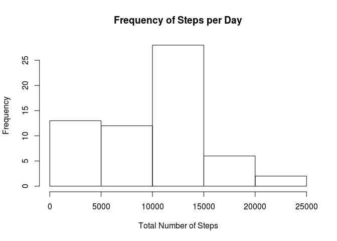
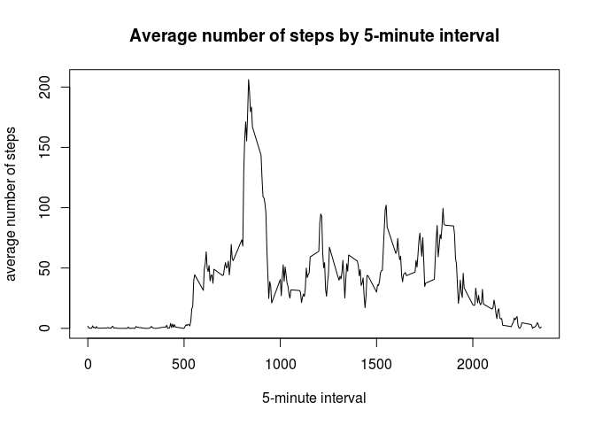
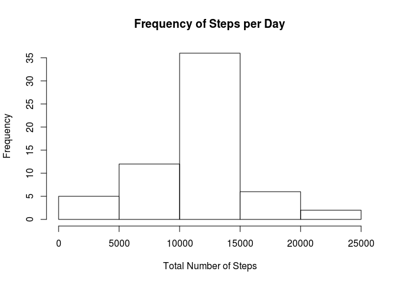

# Reproducible Research: Peer Assessment 1
  
Author: Daniela Petruzalek  
e-mail: daniela.petruzalek@gmail.com  
GitHub: https://github.com/danicat83  

## Loading and preprocessing the data
  
This section will load and preprocess the data from the Activity Monitoring data set.  

The data is from a personal activity monitoring device. The data consists of two months of data from an anonymous individual collected during the months of October and November, 2012 and include the number of steps taken in 5 minute intervals each day.

It is stored in the same repository as this R markdown file, as the file "activity.zip". 

The code below decompress and loads the "activity.csv" file containing the data and executes the following steps:

1. Load the data (i.e. read.csv())
2. Process/transform the data into a format suitable for the analysis


```r
library(dplyr)
library(lattice)

options(scipen=999, digits = 4) # change the visualization format to avoid printing scientific notation
                                # and limit digits to 4

# Decompress zip file if necessary
if( !file.exists("activity.csv") ) unzip("activity.zip")

# Load activity and apply data type transformations
activity <- tbl_df(read.csv("activity.csv", stringsAsFactors = FALSE)) %>% 
            mutate(date = as.Date(date))
```
  
## What is mean total number of steps taken per day?

For this part of the assignment, missing values in the dataset were ignored.

1. Make a histogram of the total number of steps taken each day


```r
spd <- activity %>% 
        group_by(date) %>% 
        summarize(steps_per_day = sum(steps, na.rm = TRUE))

hist(spd$steps_per_day, main = "Frequency of Steps per Day", xlab = "Total Number of Steps") 
```

<!-- -->

2. Calculate and report the mean and median total number of steps taken per day


```r
spd_mean   <- mean(spd$steps_per_day)
spd_median <- median(spd$steps_per_day)
```

The mean total number of steps taken per day is 9354.2295 and the median total number of steps taken per day is 10395.

## What is the average daily activity pattern?

1. Make a time series plot (i.e. type = "l") of the 5-minute interval (x-axis) and the average number of steps taken, averaged across all days (y-axis)


```r
by_interval <- activity %>% group_by(interval) %>% summarize(avg = mean(steps, na.rm = TRUE))

with(by_interval, {
        plot(interval, avg, type = "l", xlab = "5-minute interval", ylab = "average number of steps")
        title(main = "Average number of steps by 5-minute interval")
})
```

<!-- -->

2. Which 5-minute interval, on average across all the days in the dataset, contains the maximum number of steps?

```r
max_steps <- by_interval %>% filter(avg == max(avg))
```

The interval which contains the maxium number of steps, on average across all days, is the 835 minutes interval.

## Imputing missing values

Note that there are a number of days/intervals where there are missing values (coded as NA). The presence of missing days may introduce bias into some calculations or summaries of the data.

1. Calculate and report the total number of missing values in the dataset (i.e. the total number of rows with NAs)


```r
steps.na    <- sum(is.na(activity$steps))
date.na     <- sum(is.na(activity$date))
interval.na <- sum(is.na(activity$interval))
```

The dataset has 2304 missing values for 'steps', 0 missing values for 'date' and 0 missing values for 'interval'.

2. Devise a strategy for filling in all of the missing values in the dataset. The strategy does not need to be sophisticated. For example, you could use the mean/median for that day, or the mean for that 5-minute interval, etc.

The strategy chosen is to replace the NA's with the mean value for the given 5-minute interval. I will use the precomputed values stored in the 'by_interval' variable from the last step.

3. Create a new dataset that is equal to the original dataset but with the missing data filled in.


```r
act_no_miss <- merge(activity, by_interval) %>%              # merge the dataset by the "interval" column
        mutate(steps = ifelse(is.na(steps), avg, steps)) %>% # replace the missing values with the "avg" value
        select(steps, date, interval) %>%                    # drop the "avg" column and reset column order
        arrange(date, interval)                              # finally, arrange the data like the original dataset
```

4. Make a histogram of the total number of steps taken each day and Calculate and report the mean and median total number of steps taken per day. Do these values differ from the estimates from the first part of the assignment? What is the impact of imputing missing data on the estimates of the total daily number of steps?


```r
spd_no_miss <- act_no_miss %>% 
        group_by(date) %>% 
        summarize(steps_per_day = sum(steps))

hist(spd_no_miss$steps_per_day, main = "Frequency of Steps per Day", xlab = "Total Number of Steps") 
```

<!-- -->

```r
spd_mean_no_miss   <- mean(spd_no_miss$steps_per_day)
spd_median_no_miss <- median(spd_no_miss$steps_per_day)
```

For the adjusted data set, the mean total number of steps taken per day is 10766.1887 and the median total number of steps taken per day is 10766.1887. Those values differ from the original measure by 1411.9592 and 371.1887 respectively.

The impact of imputing the missing data is that the histogram now has a higher frequency of steps between 10k and 15k and lower steps on the 0 to 5k range. Also, both the mean and median are now higher than the previous value.

## Are there differences in activity patterns between weekdays and weekends?

For this part the weekdays() function may be of some help here. Use the dataset with the filled-in missing values for this part.

1. Create a new factor variable in the dataset with two levels -- "weekday" and "weekend" indicating whether a given date is a weekday or weekend day.


```r
act_week <- act_no_miss %>% # broke the mutate into two calls for clarity
        mutate( is.weekend = ifelse(weekdays(date, abbreviate = TRUE) %in% c("Sat","Sun"), TRUE, FALSE) ) %>%
        mutate( weekday.f  = factor(is.weekend, levels = c(FALSE, TRUE), labels = c("weekday", "weekend") ) )
```

2. Make a panel plot containing a time series plot (i.e. type = "l") of the 5-minute interval (x-axis) and the average number of steps taken, averaged across all weekday days or weekend days (y-axis).


```r
by_interval.w <- act_week %>% group_by(weekday.f, interval) %>% summarize(avg = mean(steps))

xyplot(avg ~ interval | weekday.f, by_interval.w, layout = c(1,2), type = "l", xlab = "Interval", ylab = "Number of steps")
```

<!-- -->

